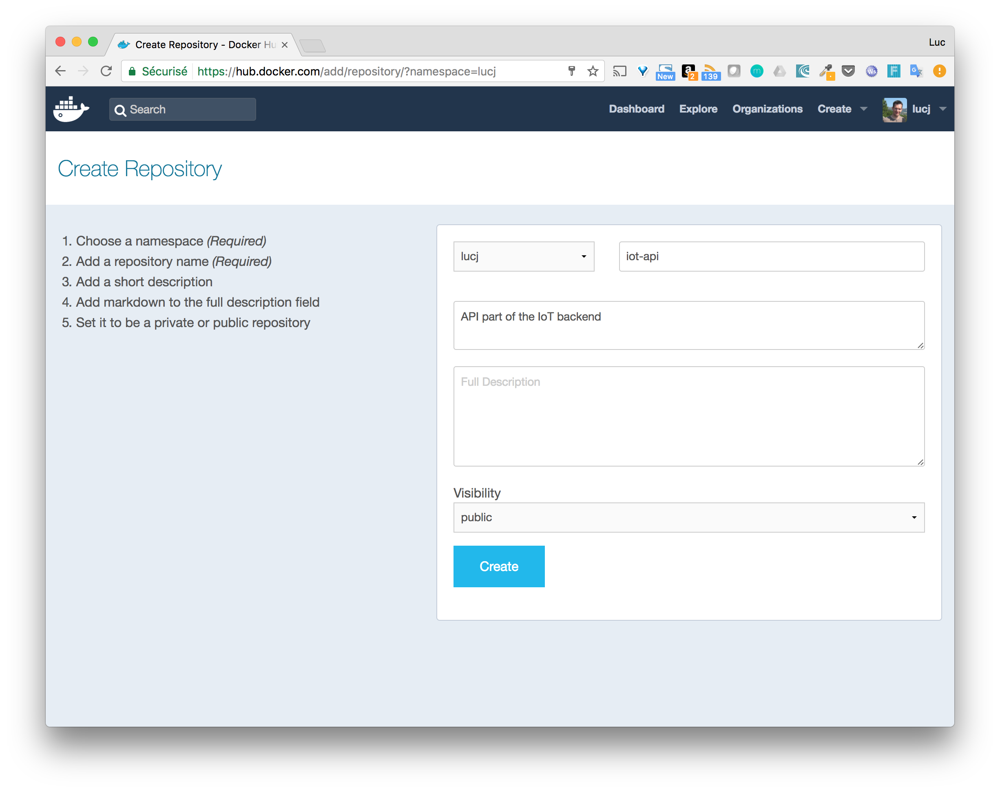
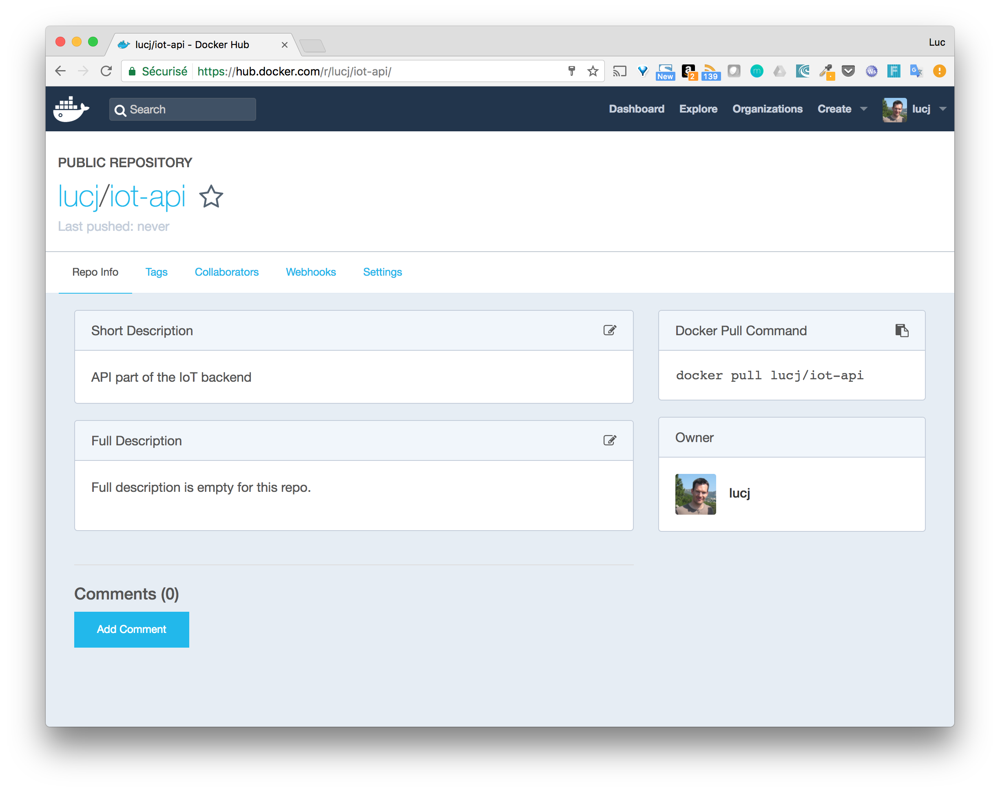
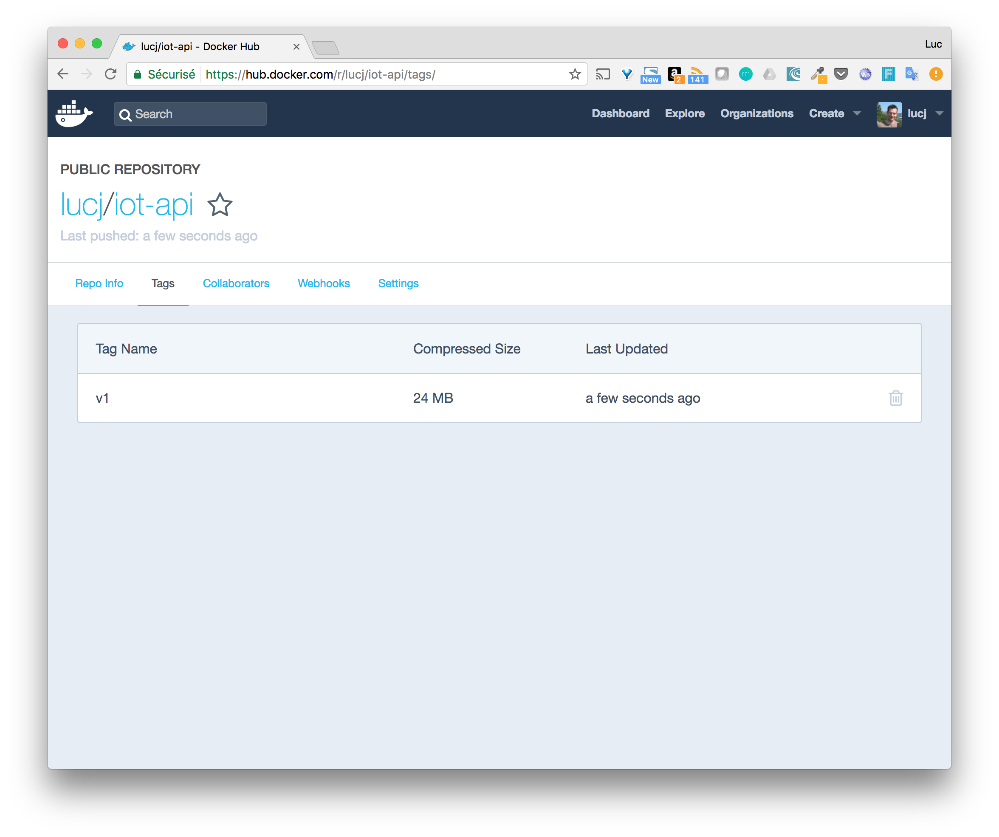

# Objectives

In this step, we will create a repository in the Docker Hub that will be used to distribute the *api* image to other environments

# Instructions

* Create an account on [Docker Hub](https://hub.docker/com)
* Create a repository named *iot-api* (we might create some other services in the next step, so using the *iot* prefix could be convenient)
* Tag the *iot:v1* image so it matches the repository format
* Push the new tagged to the Docker Hub

# Note on the iot images

Until now, we have created 1 version of the *iot* image as the following output confirms

````
$ docker image ls iot
REPOSITORY          TAG                 IMAGE ID            CREATED             SIZE
iot                 v1                  c243ef955948        6 minutes ago       71 MB
````

As this image only exist locally, we need a way to distribute it so it can be used in other environments.
This is where a registry comes into the picture and in this project we will rely on the official [Docker Hub](https://hub.docker.com).

# Create a Docker Hub account

Account creation on the Docker Hub is a simple process that can be done right from the [Docker Hub](https://hub.docker.com) index page.
Just select a username and a password and you'r done.

# Create a repository

When logged in the Docker Hub, select the "Create" menu and click on the "Create Repository". In the form displayed, we need to provide the following things
* The name of the repository: *iot-api* in this case
* A short description
* The visibility (set to Public by default) that enables to specify if the image can be downloaded by everybody or only by a limited list of users.



When the repository is created, the details will be displayed like in the following screenshot.



# Tag the existing image

The last image created locally is the *iot:v1*, as we are pretty happy with this version (at least for now on), we will publish it into our newly created repository.
In order to do so, we first need to tag the image so it follows the USERNAME/REPOSITORY:VERSION format.

This can easily be done using the following command

````
docker image tag iot:v1 lucj/iot-api:v1
````

We basically tell Docker to add a new tag on the existing *iot:v1* image

Note: make sure to use your Docker Hub username when tagging the image.

# Push the new tag to the Docker Hub

The first step is to login to the Docker Hub througt the command line using the *docker login* command.

Example:

````
$ docker login
Login with your Docker ID to push and pull images from Docker Hub. If you don't have a Docker ID, head over to https://hub.docker.com to create one.
Username (lucj):
Password:
Login Succeeded
````

Once logged in, the image can be pushed with the *docker image push* command.

Example:

````
$ docker push lucj/iot-api:v1
The push refers to a repository [docker.io/lucj/iot-api]
0894754c3439: Pushed
b07357a57dbe: Pushed
9ba73e8cc696: Pushed
2eecbdd0e662: Pushed
8e254b51dfd6: Mounted from mhart/alpine-node
v1: digest: sha256:6d6bec9e59de2e3c59feeb918c2aeba3b3bf09165d0194e5b6968147d52e9355 size: 1580
````

Going back to the Docker Hub dashboard, we can see that a tag now exist for this image.



# Summary

The image now exist on the Docker Hub and can be easily distributed.


-----
[< Previous](../step2) - [Next >](../step4)
